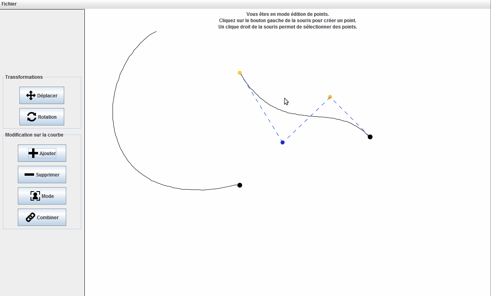

Bezier-curves
================

Context
-------

A 2D design tool built with Java for an assignement in the Ecole des Mines school. (done in pair)

Features
--------

### Curves editing

You can add a new curve using the "Ajouter" button and apply some transformations to it :

* Add a new curve by click the "Ajouter" button, then click on the right panel
* Select a curve using the right click button
* Move it using the "Déplacer" button then click and drag
* Rotate it using the "Rotation" button then, one left click if you want to move the origin, left click & drag if you want to rotate.
* Link 2 curves by first selecting one curve, then click on the "Combiner" button and select the other curve to link

### Point editing

You can edit the points position of a specific curve :

* Select one curve to edit
* Click on the "Mode" button
* Do all the transformations you want to that point (same system than curve editing)

### Save

You can save your drawing : click on Fichier -> Sauvegarder and save your image on your hard drive.
Class diagram
-------------

Here is the following class diagram of this project

